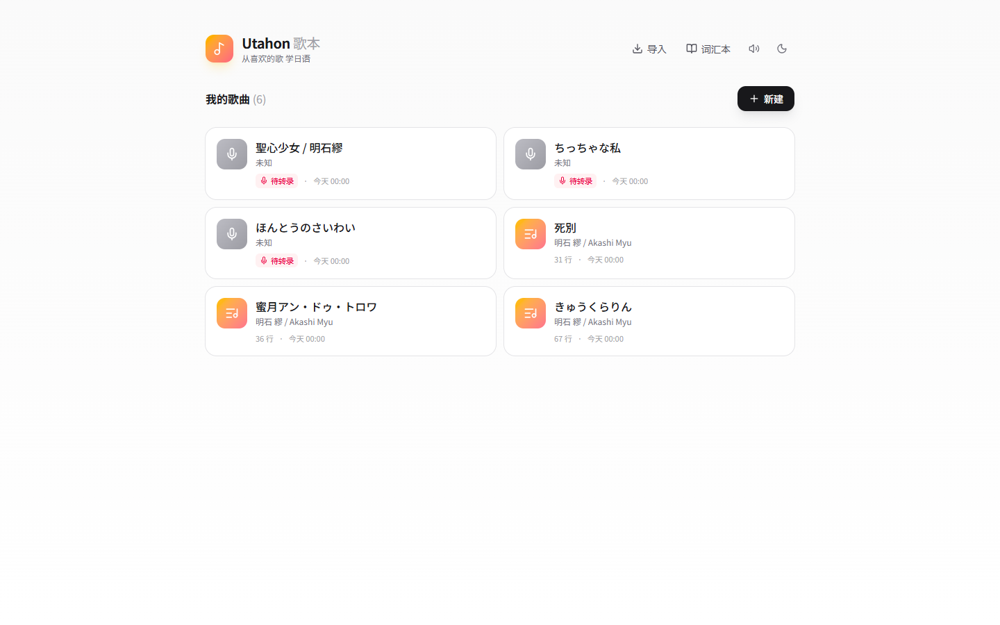
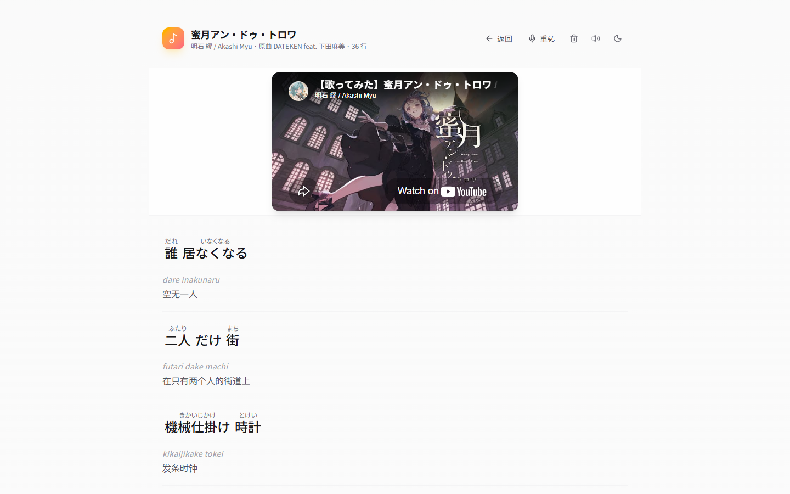
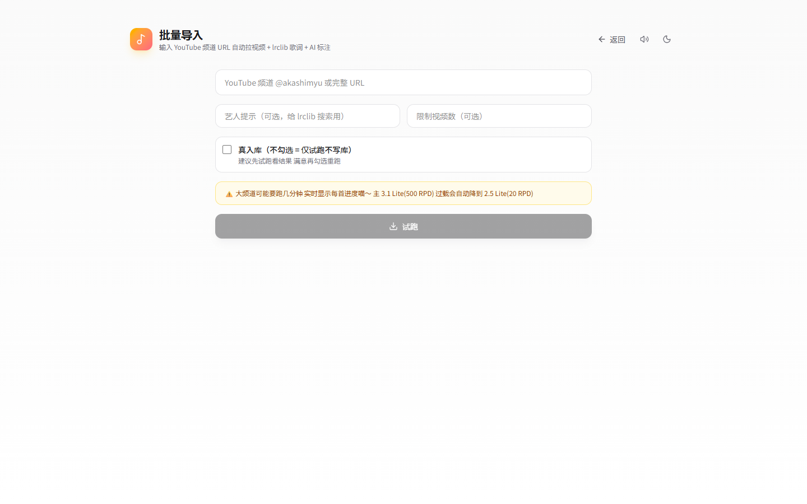

# Utahon 歌本 🎵

> 从喜欢的歌入手学日语 — 歌词 / 音译 / 翻译 / 词性三合一标注 · AI 全流程自动化



---

## ✨ 特色

- 🤖 **lrclib + Gemini 双引擎标注**：lrclib 拉歌词，Gemini 3.1 Flash Lite 自动生成汉字注音、罗马音、逐词词性、自然中文翻译
- 🎬 **YouTube / Bilibili 双源**：yt-dlp 抓音频流，Gemini 多模态转录 lrclib 未收录的翻唱歌；cookies 方案绕过两家反爬
- 🔁 **SSE 流式批量导入**：频道 URL 一贴 实时进度逐首滚动 避开 Cloudflare 100s 超时
- 🧯 **Gemini 模型容错**：Primary 503 过载自动降级到 Fallback 模型 单进程记忆避免反复试错
- ✍️ **原曲/翻唱双作者字段**：`Akashi Myu · 原曲 saewool · 31 行` 翻唱党友好
- ⌨️ **极简输入**：频道贴 `@akashimyu`、重转贴 `BV1USAQzDEav` 或 `dQw4w9WgXcQ`，完整 URL 同样接受

---

## 📷 效果预览

### 歌曲详情：歌词 + 罗马音 + 中文 + YouTube 嵌入播放



### 批量导入：一贴频道 一键拉全



---

## 🏗️ 技术栈

| 层 | 选型 |
|---|---|
| 前端 | Next.js 16 (App Router + Turbopack) · React 19 · TypeScript 5 · Tailwind CSS 4 · framer-motion |
| 后端 | Next.js Route Handlers · Node.js runtime · SSE ReadableStream |
| 存储 | SQLite (better-sqlite3) · WAL mode |
| AI | Google Gemini 3.1 Flash Lite Preview (primary) · 2.5 Flash Lite (fallback) |
| 歌词源 | [lrclib.net](https://lrclib.net) |
| 音频源 | yt-dlp (uv-managed venv) · YouTube + Bilibili cookies |
| 反向代理 | Caddy 2.11 · Cloudflare Origin Certificate · HTTP/3 |
| CI/CD | GitHub Actions (appleboy/ssh-action) · systemd |

---

## 🚀 本地开发

```bash
# 安装依赖
npm install
uv sync                    # yt-dlp 虚拟环境

# 配置 .env.local
GOOGLE_AI_API_KEY=...
GEMINI_MODEL=gemini-3.1-flash-lite-preview
GEMINI_FALLBACK_MODEL=gemini-2.5-flash-lite
YOUTUBE_COOKIES_PATH=./account_auth/www.youtube.com_cookies.txt    # 可选
BILIBILI_COOKIES_PATH=./account_auth/www.bilibili.com_cookies.txt  # 可选

# 启动
npm run dev
```

打开 `http://localhost:3000` 即可。

---

## 🌐 生产部署

本仓库自带 [`.github/workflows/deploy.yml`](.github/workflows/deploy.yml) 一条命令 push 即部署：

```
push to master
  ↓ GitHub Actions
  ↓ SSH 到 VPS /opt/utahon
  ↓ git pull --ff-only
  ↓ npm ci && npm run build
  ↓ systemctl restart utahon
```

**反向代理**：Caddy 2.11 + Cloudflare Proxied + Origin Certificate（15 年免签）+ Basic Auth  
**数据卷**：`/opt/utahon/data/utahon.db` (SQLite 单文件)  
**cookies**：`/opt/utahon/account_auth/` 目录 chmod 700（已 gitignore）

---

## 📄 License

MIT

---

*Made with ♡ by [xPeiPeix](https://github.com/xPeiPeix)*
