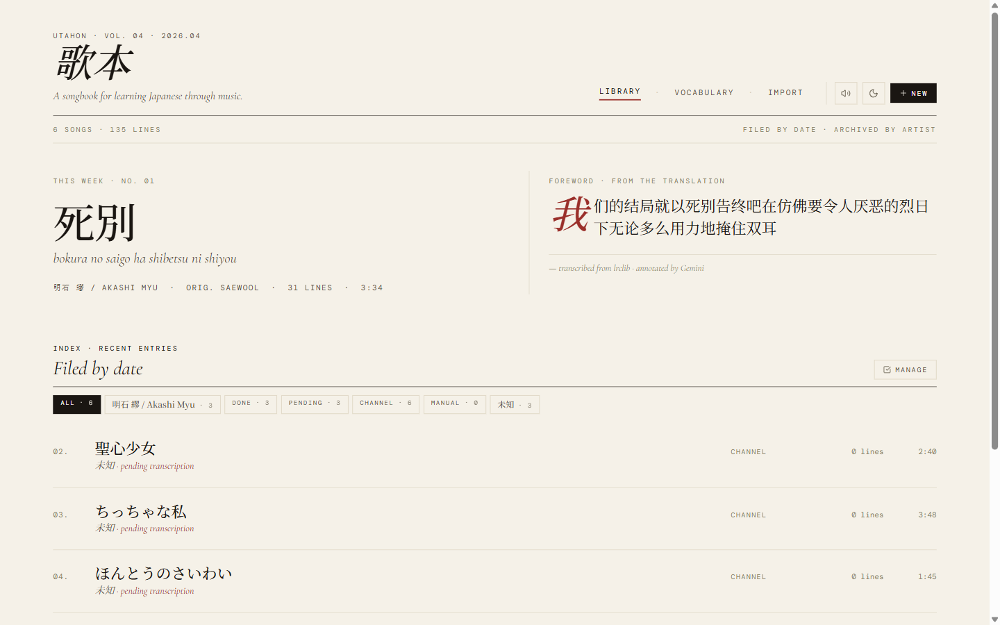
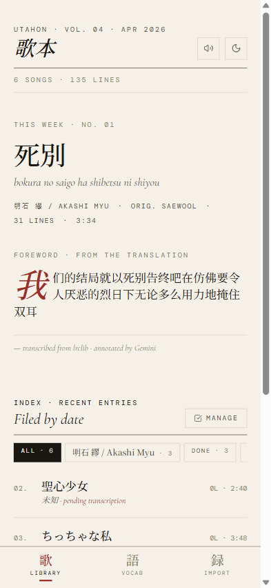
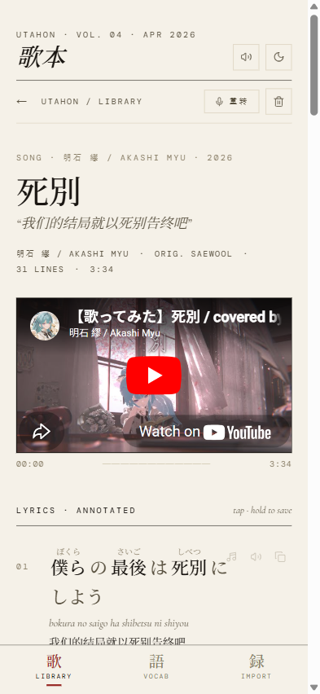
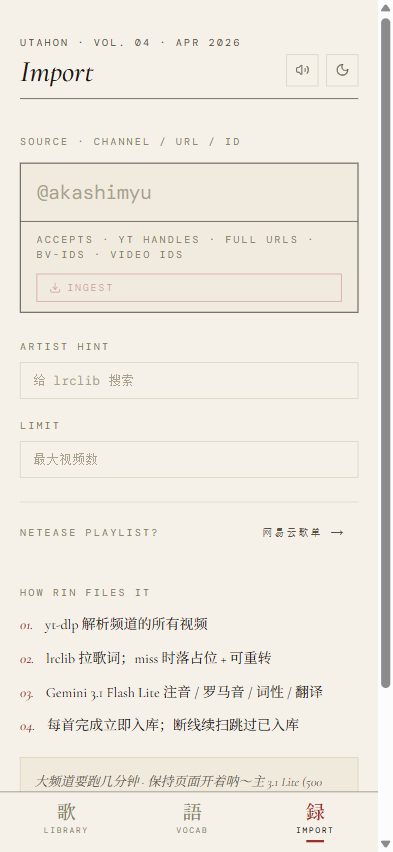
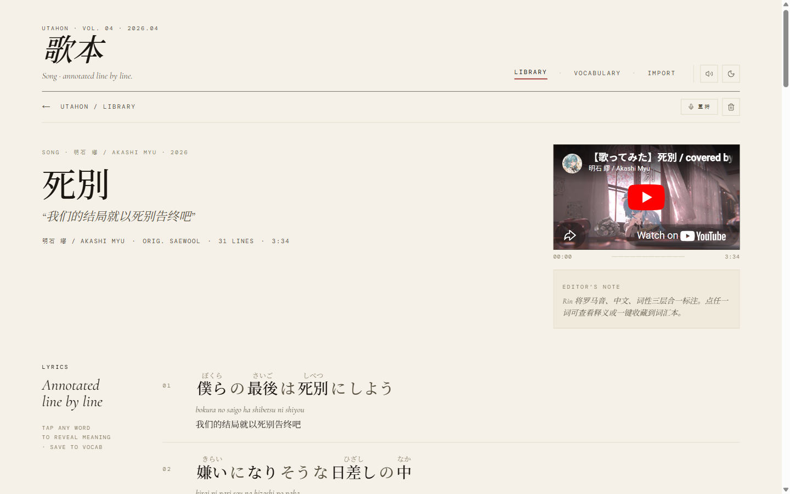
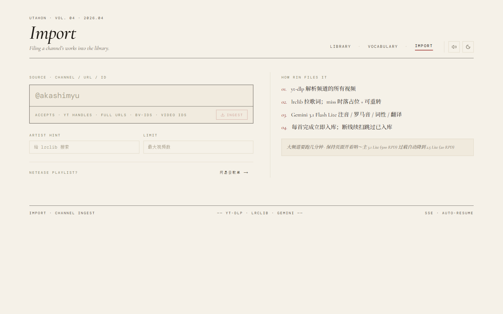

# Utahon 歌本 🎵

> 从喜欢的歌入手学日语 — 歌词 / 音译 / 翻译 / 词性三合一标注 · AI 全流程自动化



---

## ✨ 特色

- 🤖 **lrclib + Gemini 双引擎标注**：lrclib 拉歌词，Gemini 3.1 Flash Lite 自动生成汉字注音、罗马音、逐词词性、自然中文翻译
- 🎬 **YouTube / Bilibili 双源**：yt-dlp 抓音频流，Gemini 多模态转录 lrclib 未收录的翻唱歌；cookies 方案绕过两家反爬
- 🔁 **SSE 流式批量导入**：频道 URL 一贴 实时进度逐首滚动 避开 Cloudflare 100s 超时
- 🧯 **Gemini 模型容错**：Primary 503 过载自动降级到 Fallback 模型 单进程记忆避免反复试错
- ✍️ **原曲/翻唱双作者字段**：`Akashi Myu · 原曲 saewool · 31 行` 翻唱党友好
- ⌨️ **极简输入**：频道贴 `@akashimyu`、重转贴 `BV1USAQzDEav` 或 `dQw4w9WgXcQ`，完整 URL 同样接受
- 🎸 **弹唱练习台**：YouTube 或自有音频均可保留音高慢放、A/B 循环、段落循环和前后留白
- 🎼 **可编辑和弦谱**：自动和弦贴到对应歌词行，支持常用指法图、简化和弦、Capo 换指法和 ChordPro 导出
- 🎚️ **四轨练习混音**：Demucs 分出人声、鼓、贝斯、其他四轨，可逐轨调音量、静音或独听

---

## 📷 效果预览

### 📱 移动端

<table>
  <tr>
    <td></td>
    <td></td>
    <td></td>
  </tr>
  <tr>
    <td align="center"><sub>首页歌单</sub></td>
    <td align="center"><sub>歌曲详情</sub></td>
    <td align="center"><sub>批量导入</sub></td>
  </tr>
</table>

### 🖥️ 桌面端

**歌曲详情：歌词 + 罗马音 + 中文 + YouTube 嵌入播放**



**批量导入：一贴频道 一键拉全**



---

## 🏗️ 技术栈

| 层 | 选型 |
|---|---|
| 前端 | Next.js 16 (App Router + Turbopack) · React 19 · TypeScript 5 · Tailwind CSS 4 · framer-motion |
| 后端 | Next.js Route Handlers · Node.js runtime · SSE ReadableStream |
| 存储 | SQLite (better-sqlite3) · WAL mode |
| AI | Gemini 3.1 Flash Lite（歌词分析 / 分享解析）· Gemini 3.6 Flash（音频转录）· AI Gateway 或 Google 直连 |
| 音乐分析 | lv-chordia 1.1.0 · allin1 1.1.0 · Demucs 4 · PyTorch（M5 本地一次性运行） |
| 歌词源 | [lrclib.net](https://lrclib.net) |
| 音频源 | yt-dlp (uv-managed venv) · YouTube + Bilibili cookies |
| 反向代理 | Caddy 2.11 · Cloudflare Origin Certificate · HTTP/3 |
| CI/CD | GitHub Actions (appleboy/ssh-action) · systemd |

---

## 🚀 本地开发

```bash
# 安装依赖
npm install
uv sync                    # yt-dlp 虚拟环境

# 配置 .env.local（推荐走个人 AI Gateway）
AI_GATEWAY_BASE_URL=https://gateway.pei-pei.icu
AI_GATEWAY_API_KEY=...
GEMINI_ANALYZE_MODEL=gemini-3.1-flash-lite
GEMINI_SHARE_MODEL=gemini-3.1-flash-lite
GEMINI_TRANSCRIBE_MODEL=gemini-3.6-flash
GEMINI_FALLBACK_MODEL=gemini-2.5-flash-lite
YOUTUBE_COOKIES_PATH=./account_auth/www.youtube.com_cookies.txt    # 可选
BILIBILI_COOKIES_PATH=./account_auth/www.bilibili.com_cookies.txt  # 可选

# 启动
npm run dev
```

打开 `http://localhost:3000` 即可。

`AI_GATEWAY_BASE_URL` 填网关根地址，不要附加 `/v1` 或 `/v1beta`。网关地址和 key 必须同时设置；未设置时会继续读取 `GOOGLE_AI_API_KEY` 直连 Google。旧的 `GEMINI_MODEL` 仍可作为三个任务的统一模型配置，任务专用变量优先级更高。

### 🎸 生成练习谱与分轨

歌曲页先点 `Upload audio` 上传自己持有的音频。上传完成后，URL 中 `/song/` 后面的字符串就是 song ID。模型不常驻服务器，而是在 Apple Silicon Mac 上一次性分析，再通过 SSH 把结果导回当前音频版本。

```bash
# 首次安装分析环境（Python 3.10，由 uv 管理）
cd audio-worker
./setup.zsh

# 和弦 + BPM/节拍/段落 + Demucs 四轨，一次完成
uv run --no-sync python utahon_analyze.py --song <song-id>

# 只生成可编辑和弦草稿
uv run --no-sync python utahon_analyze.py --song <song-id> --phase chords

# 更慢但更完整的 8 模型结构集成
uv run --no-sync python utahon_analyze.py \
  --song <song-id> --allin-model harmonix-all
```

默认 SSH alias 是 `2c2g5-c`，远端目录是 `/opt/utahon`；可用 `--host` 和 `--remote-root` 覆盖。自动分析不会覆盖手工改过的和弦、段落、Capo 或谱面显示选择。自有音频与四轨保存在 `data/practice/`，不进入 Git。

---

## 🌐 生产部署

本仓库自带 [`.github/workflows/deploy.yml`](.github/workflows/deploy.yml) 一条命令 push 即部署：

```
push to master
  ↓ GitHub Actions
  ↓ SSH 到 VPS /opt/utahon
  ↓ git pull --ff-only
  ↓ npm ci && npm run build
  ↓ systemctl restart utahon
```

**反向代理**：Caddy 2.11 + Cloudflare Proxied + Origin Certificate（15 年免签）+ Basic Auth  
**数据卷**：`/opt/utahon/data/utahon.db` (SQLite) · `/opt/utahon/data/practice/`（自有音频与分轨）
**cookies**：`/opt/utahon/account_auth/` 目录 chmod 700（已 gitignore）

---

## 📄 License

MIT

---

*Made with ♡ by [xPeiPeix](https://github.com/xPeiPeix)*
