# Utahon 架构梳理

## 1. 系统总览（按钮 ↔ 实现链路）

```mermaid
flowchart TB

%% ============ 页面层 ============
subgraph H["🏠 / 主页"]
    direction LR
    H1["➕ 新建"]
    H2["📥 导入"]
    H3["📖 词汇本"]
    H4["🎵 歌曲卡片"]
    H5["🗑️ 删歌"]
end

subgraph N["📝 /new 新建歌曲"]
    direction LR
    N1["📥 lrclib 拉取"]
    N2["✨ 分析并保存"]
end

subgraph S["🎶 /song/[id] 详情"]
    direction LR
    S1["🎤 重转"]
    S2["🗑️ 删歌"]
    S3["🎵 播放片段"]
    S4["🔊 朗读行"]
    S5["📋 复制行"]
    S6["词Token点击"]
    S7["⭐ 收藏到词汇本"]
end

subgraph I["📥 /import 批量导入"]
    I1["📥 开始/试跑"]
end

subgraph V["📖 /vocabulary 词汇本"]
    V1["🗑️ 删词"]
end

%% ============ 后端 API ============
subgraph API["🔌 Next.js Route Handlers"]
    direction LR
    A1["POST /api/songs<br/>analyzeLyrics + createSong"]
    A2["POST /api/lrclib<br/>fetchLrclibLyrics"]
    A3["DELETE /api/songs/[id]<br/>deleteSong"]
    A4["POST /api/songs/[id]<br/>/retranscribe<br/>transcribeYoutube"]
    A5["POST /api/vocabulary<br/>addVocab (INSERT OR IGNORE)"]
    A6["DELETE /api/vocabulary/[id]<br/>deleteVocab"]
    A7["POST /api/ingest<br/>runIngest"]
end

%% ============ 外部依赖 ============
subgraph EXT["🌐 外部服务"]
    direction LR
    LRC["📚 lrclib.net<br/>歌词数据库"]
    YT["📺 YouTube IFrame<br/>seekTo + pause"]
    GEMINI["🧠 Gemini 3.1 Flash Lite<br/>切词 + 翻译 + 音频转录"]
    YTDLP["⬇️ yt-dlp + uv<br/>列视频 / 下 m4a"]
end

%% ============ 浏览器 API ============
subgraph BR["🌐 浏览器 API"]
    BR1["SpeechSynthesis<br/>(lib/tts.ts)"]
    BR2["Clipboard"]
end

%% ============ 数据层 ============
DB[("💾 SQLite WAL<br/>songs + vocabulary")]

%% ============ 跳转关系（页面间）============
H1 ==> N
H2 ==> I
H3 ==> V
H4 ==> S
H5 -.同源.-> S2

%% ============ 按钮 → API ============
N1 --> A2
N2 --> A1
S1 --> A4
S2 --> A3
S7 --> A5
I1 --> A7
V1 --> A6

%% ============ 按钮 → 浏览器 / IFrame ============
S3 -.->|usePlayer Context| YT
S4 -.-> BR1
S5 -.-> BR2
S6 -.弹出含 ⭐.-> S7

%% ============ API → 外部/lib ============
A1 --> GEMINI
A2 --> LRC
A4 --> YTDLP
A4 --> GEMINI
A7 --> YTDLP
A7 --> LRC
A7 --> GEMINI

%% ============ API → DB ============
A1 --> DB
A3 --> DB
A4 --> DB
A5 --> DB
A6 --> DB
A7 --> DB

classDef pageStyle fill:#fef3c7,stroke:#f59e0b,color:#78350f
classDef apiStyle fill:#dbeafe,stroke:#3b82f6,color:#1e3a8a
classDef extStyle fill:#fce7f3,stroke:#ec4899,color:#831843
classDef brStyle fill:#e0e7ff,stroke:#6366f1,color:#312e81
classDef dbStyle fill:#d1fae5,stroke:#10b981,color:#064e3b

class H,N,S,I,V pageStyle
class API apiStyle
class EXT extStyle
class BR brStyle
class DB dbStyle
```



---

## 2. 一首歌从头到尾的数据流（4 个环节）

```
[环节 A] 拿到 LRC 文本
   ↓
[环节 B] 把文本按时间戳切成"行"
   ↓
[环节 C] 把每行切成"词" + 翻译 + 词义 + furigana
   ↓
[环节 D] 给每个词补 romaji（罗马音）
   ↓
存进 SQLite songs.analyzed (JSON 字符串)
```

---

### 环节 A：LRC 文本来源（**3 种独立路径**）

| 路径 | 触发 | 实现者 | 准确率 |
|---|---|---|---|
| **A1. 用户手粘** | `/new` 表单 textarea | 用户自己 | 100% |
| **A2. lrclib 拉取** | `/new` 的 📥 按钮 / `/import` ingest | `lib/lrclib.ts` 调 lrclib.net API | 100%（人工录入数据库） |
| **A3. Gemini 多模态 ASR** | 详情页 🎤 重转按钮 | `lib/transcribe.ts` 用 yt-dlp 拉 m4a → Gemini 听 | ~80%（唱歌识别难） |

**✅ 关键澄清**：
- A1/A2 是**纯文本传入**，根本没"音频"这一步
- A3 才有"音频→文本"，由 **Gemini 多模态**完成

输出形态都是同一种 LRC 字符串：
```
[00:12.34]うるさく鳴いた
[00:15.67]文字盤を見てた
[00:18.92]きっと きっと 鏡越し
```

---

### 环节 B：行切分（按时间戳）

| | |
|---|---|
| **实现** | `lib/lrc-parser.ts` |
| **算法** | 正则匹配 `[mm:ss.xx]` 时间戳，纯 JavaScript |
| **AI?** | ❌ 不用 AI |

**输出**：
```ts
ParsedLine[] = [
  { startTime: 12.34, endTime: 15.67, text: "うるさく鳴いた" },
  { startTime: 15.67, endTime: 18.92, text: "文字盤を見てた" },
  ...
]
```

`endTime` 取下一行的 `startTime`，最后一行 endTime = startTime（用 0 兜底）。

如果是**纯文本歌词**（无时间戳）→ 走 `parsePlainLines()`，所有行 startTime=endTime=0，前端 🎵 按钮自动隐藏。

---

### 环节 C：词切分 + 翻译 + 词义 + furigana ★

**这是 Gemini 真正干活的地方** ★

| | |
|---|---|
| **实现** | `lib/gemini.ts` 的 `analyzeLines()` |
| **模型** | `gemini-3.1-flash-lite-preview` (500 RPD) |
| **调用方式** | 一次 API 调用，**同时返回 4 类信息** |
| **强约束** | JSON Schema (responseSchema) 强制结构化输出 |

**Prompt 核心规则**：
```
对每一行返回:
1. original   - 原文照抄
2. translation - 「信达雅」中文翻译（保留意象 / 意境呼应 / 留白克制）
3. tokens     - 实词拆分，每个含 surface/furigana/meaning/pos

规则:
- tokens 含名词/动词/形容词/副词/惯用表达
- 跳过纯助词 (は・が・を・に・で)、だ・です、语气词 (よ・ね・な)
- 复合词作单个 token (如「歩き回る」不拆)
- furigana 只含平假名
```

**翻译上下文**：`analyzeLines()` 接受可选第二参数 `{ title, artist }`，会在 prompt 顶部插入「歌曲信息」段落，避免模型按散文/对白翻译歌词。详见 [`docs/roadmap-translation-quality.md`](./roadmap-translation-quality.md) 的 Phase A 章节。

**输出**：
```ts
AnalyzedLine[] = [{
  original: "うるさく鳴いた",
  translation: "吵闹地鸣叫着",
  tokens: [
    { surface: "うるさく", furigana: "うるさく", meaning: "吵闹地", pos: "adverb" },
    { surface: "鳴いた",   furigana: "ないた",   meaning: "鸣叫了", pos: "verb" },
  ],
  startTime: 12.34, endTime: 15.67,
}, ...]
```

**容错**：调用包裹了 `callWithRetry`，遇到 503/429/网络错误自动指数退避重试 3 次（1.5s / 3s / 6s）。

---

### 环节 D：罗马音 romaji

| | |
|---|---|
| **实现** | `lib/romaji.ts` 的 `toRomaji()` |
| **AI?** | ❌ 不用 AI，纯离线库 |
| **路由** | 纯假名 → **wanakana**（精准）／含汉字 → **kuroshiro**（fallback） |

**为什么不让 Gemini 出 romaji？**
- wanakana 对纯假名是**确定性映射**（は→ha, ら→ra），100% 准
- 之前测试发现 Gemini 偶尔会把「は」当助词输出 "wa" 而非 "ha"，乱
- kuroshiro 用 kuromoji 形态分析，对汉字读音有上下文判断（虽然也偶尔错）

**填充时机**：在 `lib/analyze-pipeline.ts:28-42` 给每个 token 调 `toRomaji(token.furigana || token.surface)` 补字段。

---

## 3. Gemini 用几次？

| 场景 | Gemini 调用次数 | 说明 |
|---|---:|---|
| **新建/导入一首歌**（已有歌词） | **1 次** | 步骤 C，切词+翻译+词义+furigana 一次出 |
| **重转一首歌**（音频转录） | **2 次** | +1 次步骤 A3，audio → LRC text |
| **TTS 朗读** | 0 | 用浏览器 SpeechSynthesis |
| **YouTube 片段播放** | 0 | 纯 IFrame API |
| **lrclib 拉取** | 0 | 用 lrclib.net 数据库 |

---

## 4. 数据保存

### 4.1 SQLite 表结构（`lib/db.ts`）

**`songs` 表**：
| 列 | 类型 | 用途 |
|---|---|---|
| `id` | TEXT (UUID) | 主键 |
| `title` / `artist` | TEXT | 元数据 |
| `lyrics` | TEXT | 原始 LRC 字符串 |
| **`analyzed`** | **TEXT (JSON)** | **整个 AnalyzedSong 序列化** |
| `lines_count` | INT | 行数（避免 JSON 解析） |
| `youtube_url` / `youtube_id` | TEXT | 视频引用 |
| `lrclib_id` | INT | lrclib 的歌曲 ID（去重用） |
| `created_at` / `updated_at` | INT | 时间戳 |

**`vocabulary` 表**：
| 列 | 类型 |
|---|---|
| `id` (UUID) | 主键 |
| `surface` / `furigana` / `romaji` / `meaning` / `pos` | 词信息 |
| `source_song_id` / `source_song_title` | 来源歌曲 |
| `UNIQUE(surface, source_song_id)` | 防重复收藏 |

### 4.2 为什么 `analyzed` 用 JSON 而不展开多表？

| 优 | 缺 |
|---|---|
| Schema 弹性大，加新字段不用 ALTER TABLE | 改一个 token 要重写整段 JSON |
| 单歌全数据一次取出，没有 JOIN 开销 | 不能用 SQL 直接搜 token |
| 跟 TypeScript 类型一一对应 | 字段名拼错只能跑时发现 |

**适合个人级数据量**（几百到几千首歌），不适合生产级搜索/统计。

---

## 5. 现有按钮触发的所有写操作

| 按钮 | 触发的写 | 影响 |
|---|---|---|
| ✨ 分析并保存 | INSERT songs | 新增一首歌 |
| 📥 ingest 入库 | INSERT songs (×N) | 批量新增 |
| 🎤 重转 | UPDATE songs (lyrics + analyzed) | 覆盖现有歌词 |
| 🗑️ 删歌 | DELETE songs | 删除 |
| ⭐ 收藏 | INSERT OR IGNORE vocabulary | 新增词（去重） |
| 🗑️ 删词 | DELETE vocabulary | 删除 |

---

## 6. 失败容错策略

| 失败 | 处理 |
|---|---|
| **Gemini 503/429** | `callWithRetry` 指数退避 1.5s/3s/6s，最多 3 次 |
| **lrclib 没收录** | ingest skip + 失败列表汇总；`/new` 弹错误提示 |
| **lrclib `/api/get` 必填 artist** | 自动降级到 `/api/search?q=` |
| **YouTube Short**（duration<60s） | ingest 自动 skip，不入库 |
| **同曲多 cover** | `existsByLrclibId` 跳过已入库的相同 lrclib_id |
| **同 youtube_id 重复** | `existsByYoutubeId` 跳过 |
| **音频文件 > 18MB** | `lib/transcribe.ts` 抛错，提示 inlineData 上限 |
| **数据库迁移** | `ensureColumn()` 启动时自动 ALTER TABLE 加缺失列 |
